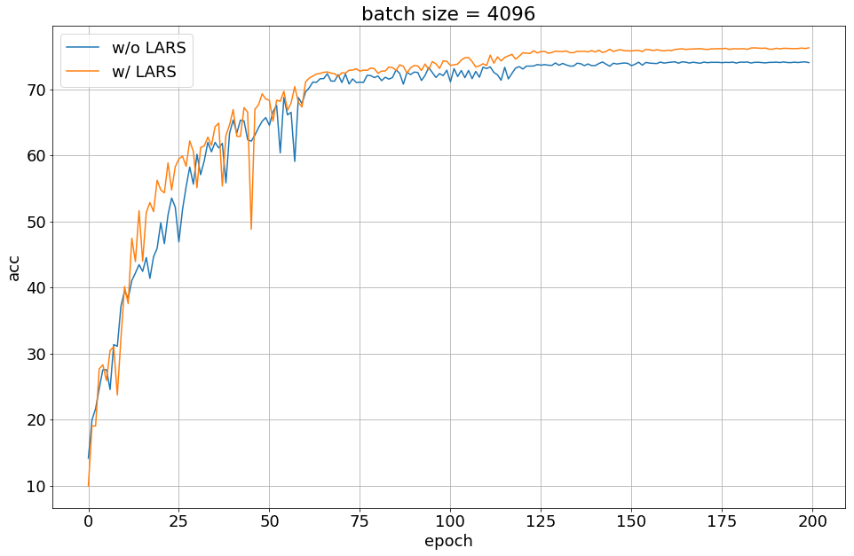
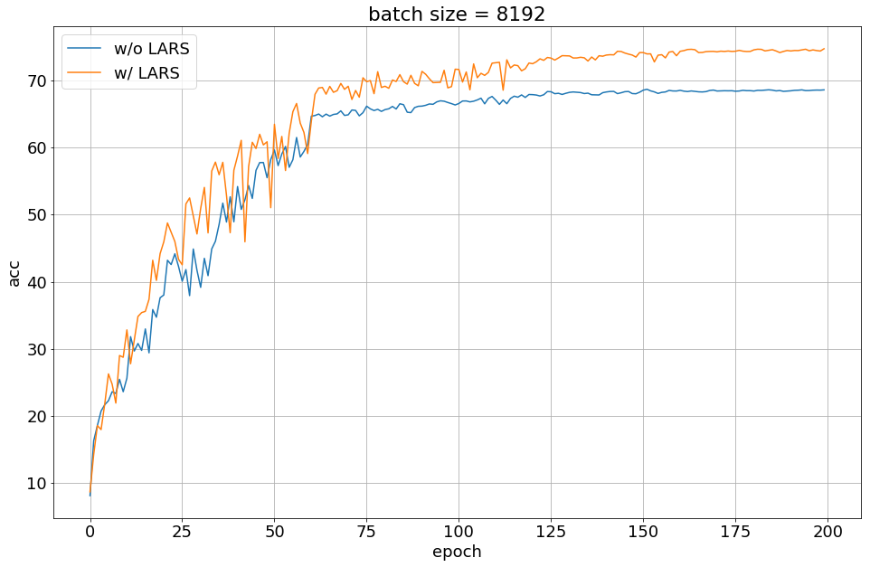

# PyTorch implementation of LARS (Layer-wise Adaptive Rate Scaling)
This repository contains code for **LARS (Layer-wise Adaptive Rate Scaling)** based on [Large Batch Training of Convolutional Networks](https://arxiv.org/abs/1708.03888) implemented in PyTorch.

## Requirements
- Python 3.6
- PyTorch 1.0

## Usage
```python
from lars import LARS

optimizer = torch.optim.LARS(model.parameters(), lr=0.1, momentum=0.9)
optimizer.zero_grad()
loss_fn(model(input), target).backward()
optimizer.step()
```

## Results
### CIFAR-10


